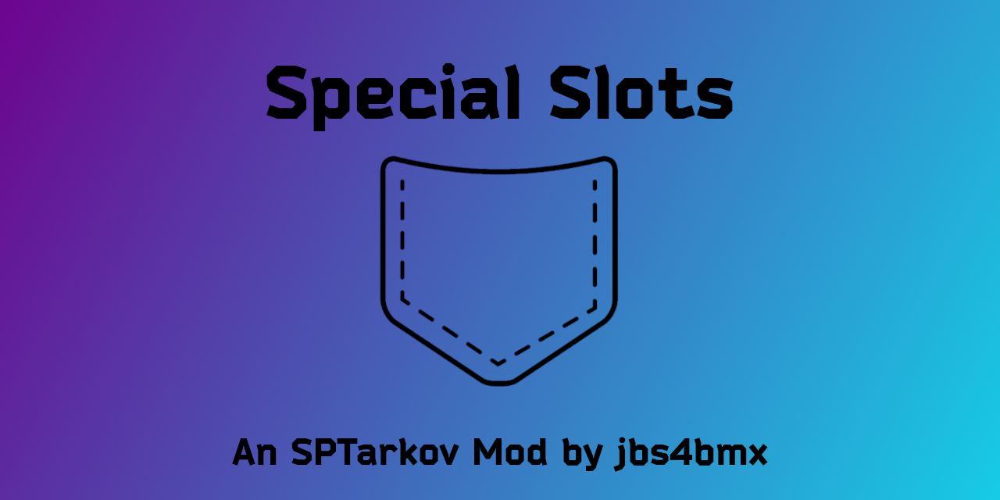

<a id="readme-top"></a>
[![Contributors][contributors-shield]][contributors-url]
[![Forks][forks-shield]][forks-url]
[![Stargazers][stars-shield]][stars-url]
[![Issues][issues-shield]][issues-url]
[![MIT License][license-shield]][license-url]

<!-- PROJECT LOGO -->
<br />
<div align="center">
  <a href="https://github.com/jbs4bmx/SpecialSlots">
    
  </a>

  <h3 align="center">Special Slots</h3>

  <p align="center">Hold on to it all.<br /></p>

  [](https://ko-fi.com/X8X611JH15)
</div>


<!-- TABLE OF CONTENTS -->
<details>
  <summary>Table of Contents</summary>
  <ol>
    <li>
      <a href="#about-the-project">About The Project</a>
      <ul>
        <li><a href="#mod-compatibility">Mod Compatibility</a></li>
        <li><a href="#pros-and-cons">Pros and Cons</a></li>
        <li><a href="#built-with">Built With</a></li>
      </ul>
    </li>
    <li>
      <a href="#getting-started">Getting Started</a>
      <ul>
        <li><a href="#prerequisites">Prerequisites</a></li>
        <li><a href="#installation">Installation</a></li>
      </ul>
    </li>
    <li><a href="#configuration">Configuration</a></li>
      <ul>
        <li><a href="#mod-faq">Mod FAQ</a></li>
      </ul>
    <li><a href="#roadmap">Roadmap</a></li>
    <li><a href="#contributing">Contributing</a></li>
    <li><a href="#license">License</a></li>
    <li><a href="#acknowledgments">Acknowledgments</a></li>
  </ol>
</details>


<!-- ABOUT THE PROJECT -->
## About The Project
Type: Client Mod & Server Mod</br>
Disclaimer: **This mod is provided _as-is_ with _no guarantee_ of support.**

You have 3 "SPEC" slots. My question is, "Why not allow all items to be placed in those slots?"</br>
Well, here you go. Special Slots now hold all.

**New as of version 390.0.2** - Special Slots now contains both a Server and a Client mod. The Client mod (also aptly named SpecialSlots.dll) aims to hide the slot view of containers placed into a Special Slot. Some containers, such as rigs, still show their slot views when placed into Special Slots.


### Mod Compatibility
Compatible with ServerValueModifier's custom pockets. (Some limitations are expected.)
  * Special Slots are only visible when using a 1 cell width for each of the 4 pockets.
    - Exception: Using only 3 or less pockets, you can expand them horizontally so long as they don't total more than 4 wide.
    - For example; if you increase the width of your pockets to 2 cells each, then this will "push" Special Slots off screen (technically under your invetory box) and you will not be able to use them.


### Pros and Cons
Pros:
  * Special Slots can hold anything.
  * Special Slots can be used to hold containers so you can hold even more items.
  * Special Slots retain everything after death. (See 'Cons' section for the one exception - insurance.)

Cons:
  * Special Slots cannot hold stacks of objects such as Ammo unless they are in a container.
    - There no ETA for a fix for this "feature".
  * **Insurance** - Containers/Weapons/Items placed into Special Slots that have been insured will go through the insurance process upon your death.
    - For example; if you have an insured container full of awesome loot in a Special Slot when you die, then you loose the loot and the container is subject to the insurance process.
<br><br>

<p align="right">(<a href="#readme-top">back to top</a>)</p>


### Built With
| Frameworks/Libraries                                      | Name         | Link                                       |
| :-------------------------------------------------------: | :----------: | :----------------------------------------: |
|               | `C Sharp`    | [C# Documentation][CSharp-url]             |
|       | `TypeScript` | [TypeScript Website][TypeScript-url]       |

|                         IDEs                                |      Name       | Link                                      |
| :---------------------------------------------------------: | :-------------: | :---------------------------------------: |
|  | `Visual Studio` | [Visual Studio Website][VisualStudio-url] |
|        | `VSCode`        | [VSCode Website][Vscode-url]              |

<p align="right">(<a href="#readme-top">back to top</a>)</p>


<!-- GETTING STARTED -->
## Getting Started
This section will explain how to install and use this mod.

### Prerequisites
EFT and SPT are required to use this mod.

### Installation
_For the purpose of these directions, "[SPT]" represents your SPT folder path._

Start by downloading the mod from the [Releases](https://github.com/jbs4bmx/SpecialSlots/releases) page.

Follow these steps to install and configure the mod:
  1. Extract the contents of the zip file into the root of your [SPT] folder.
     - That's the same location as "SPT.Server.exe" and "SPT.Launcher.exe".
  2. Start SPT.Server.exe and wait until it fully loads.
  3. Start SPT.Launcher.exe.
  4. Now you can launch the game.
  5. To configure or use the mod, press F12 while in game. Mod will be listed among client mods in the BepInEx menu.

<p align="right">(<a href="#readme-top">back to top</a>)</p>


<!-- CONFIGURATION EXAMPLES -->
## Configuration
Edit '.\config.jsonc' file as desired. <br>
```jsonc
{
    // ====================================================================================================
    // CAPABILITY_SELECTION
    // Choose 1 or more options.
    // Determines the version of the mod to load. (Default = "AllItems")
    // NOTE 1: If "AllItems" is set to "true", the other options will be ignored.
    // NOTE 2: Set "AllItems" to false if using the any of the other options.
    // NOTE 3: Special Items will always be allowed in the Special Slots. (Game default.)
    // ====================================================================================================

    "AllItems": true,

    // ====================================================================================================
    // NOTE: All options below this line require that "AllItems" be set to false for them to work.
    // ====================================================================================================
    "LimitedItems": {
        "Meds": false,
        "Firearms": false,
        "FoodAndDrink": false,
        "Throwables": false,
        "BarterItems": false,
        "Maps": false,
        "SecureContainers": false,
        "Containers": false,
        "Rigs": false,
        "Armors": false,
        "RepairKits": false,
        "CustomItems": false
    },

    // ====================================================================================================
    // Add the specific IDs of the items you want to be allowed into special slots here. This Should work for modded items
    // The included example IDs are, in order: Wallet, WZ Wallet, Gingy keychain, Key Tool, Alyonka chocolate bar
    // NOTE: This list is only applied if "CustomItems" is set to "true"
    // ====================================================================================================
    "CustomIDsList": [
        "5783c43d2459774bbe137486",
        "60b0f6c058e0b0481a09ad11",
        "62a09d3bcf4a99369e262447",
        "59fafd4b86f7745ca07e1232",
        "57505f6224597709a92585a9"
    ]
}
```

All other configurations are done within the BepInEx F12 menu while in-game.</br>
Customizations:
  - Enable/Disable client mod.
  - Change minimum distance from player that bodies must be at in order to be removed. (distance expressed in meters)
  - Instant removal button in BepInEx menu (F12). Now you can instantly trigger the body removal to occur. Any bodies within your minimum distance from you will not be removed.

<p align="right">(<a href="#readme-top">back to top</a>)</p>

### Mod FAQ
   1. Where do I report bugs found with the current version of the mod?
      - You can report bugs for the current version of this mod here: [SS Mod Page](https://hub.sp-tarkov.com/files/file/775-special-slots/).


<!-- ROADMAP -->
## Roadmap
- [x] Add Changelog
- [ ] Improve slot expansion hide methods to encompase all containerized items.

Suggest changes or view/report issues [here](https://github.com/jbs4bmx/SpecialSlots/issues).

<p align="right">(<a href="#readme-top">back to top</a>)</p>


<!-- CONTRIBUTING -->
## Contributing
Contributions are what make the open source community such an amazing place to learn, inspire, and create. Any contributions you make are **greatly appreciated**.

If you have a suggestion that would make this better, please fork the repo and create a pull request. You can also simply open an issue with the tag "enhancement".
Don't forget to give the project a star! Thanks again!

1. Fork the Project
2. Create your Feature Branch (`git checkout -b feature/AmazingFeature`)
3. Commit your Changes (`git commit -m 'Add some AmazingFeature'`)
4. Push to the Branch (`git push origin feature/AmazingFeature`)
5. Open a Pull Request

You can also buy me a coffee! (This is not required, but I greatly appreciate any support provided.)</br>
[](https://ko-fi.com/X8X611JH15)

<p align="right">(<a href="#readme-top">back to top</a>)</p>


<!-- LICENSE -->
## License
Distributed under the MIT License. See `LICENSE.txt` for more information.

<p align="right">(<a href="#readme-top">back to top</a>)</p>


<!-- ACKNOWLEDGMENTS -->
## Acknowledgments
Contributors:</br>
[Erabior](https://github.com/Erabior)

<p align="right">(<a href="#readme-top">back to top</a>)</p>


<!-- Repository Metrics -->
[contributors-shield]: https://img.shields.io/github/contributors/jbs4bmx/SpecialSlots.svg?style=for-the-badge
[contributors-url]: https://github.com/jbs4bmx/SpecialSlots/graphs/contributors
[forks-shield]: https://img.shields.io/github/forks/jbs4bmx/SpecialSlots.svg?style=for-the-badge
[forks-url]: https://github.com/jbs4bmx/SpecialSlots/network/members
[stars-shield]: https://img.shields.io/github/stars/jbs4bmx/SpecialSlots.svg?style=for-the-badge
[stars-url]: https://github.com/jbs4bmx/SpecialSlots/stargazers
[issues-shield]: https://img.shields.io/github/issues/jbs4bmx/SpecialSlots.svg?style=for-the-badge
[issues-url]: https://github.com/jbs4bmx/SpecialSlots/issues
[license-shield]: https://img.shields.io/github/license/jbs4bmx/SpecialSlots.svg?style=for-the-badge
[license-url]: https://github.com/jbs4bmx/SpecialSlots/blob/master/LICENSE.txt

<!-- Framwork/Library URLs -->
[CSharp-url]: https://learn.microsoft.com/en-us/dotnet/csharp/
[TypeScript-url]: https://www.typescriptlang.org/
[Vscode-url]: https://code.visualstudio.com/
[VisualStudio-url]: https://visualstudio.microsoft.com/
